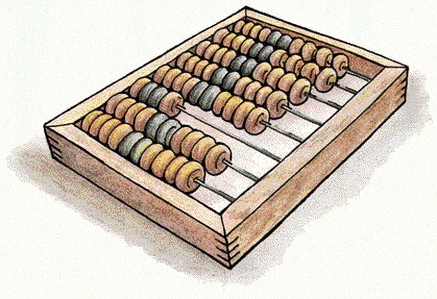
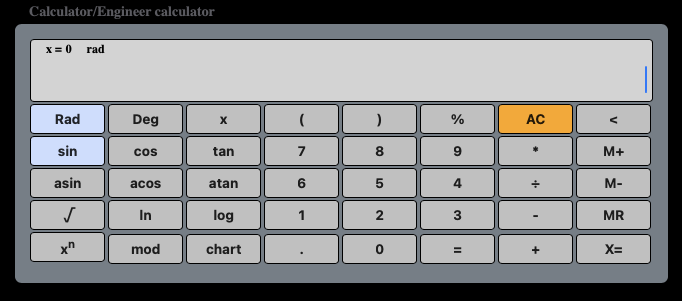
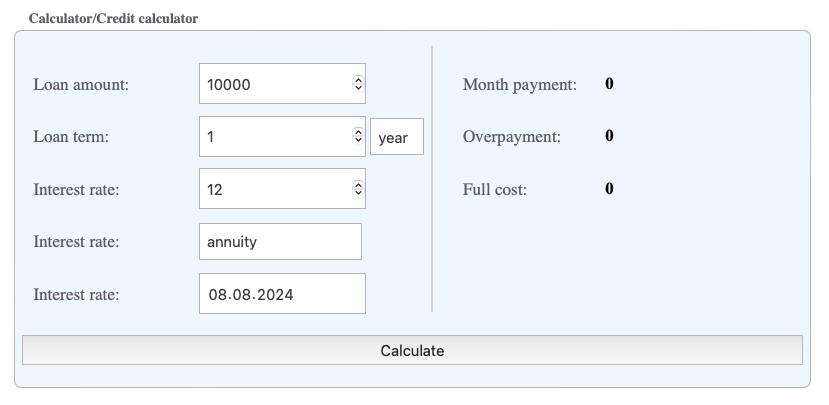
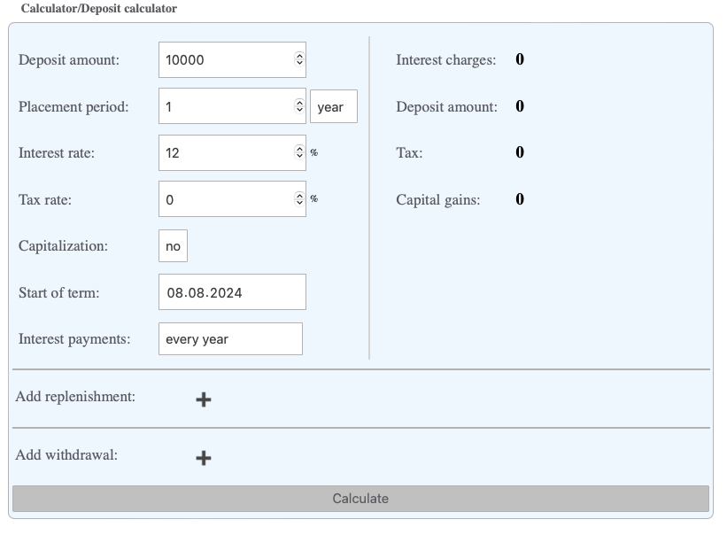

# WebCalculator
###  Инженерный, кредитный и калькулятор вкладов, построение графиков функций

- ### [Вступление](#вступление)
- ### [Цели](#цели)
- ### [Инженерный калькулятор](#Инженерный-калькулятор)
- ### [Построение графиков функций](#Построение-графиков-функций)
- ### [Кредитный калькулятор](#Кредитный-калькулятор)
- ### [Калькулятор вкладов](#Калькулятор-вкладов)
- 
## Вступление
  Зачем же изобретать велосипед скажете вы?
  Есть огромное количество уже готовых решений подобного рода, и идея создания не нова.
  Но многие из них обладают недостатками с моей (субьективной точки зрения).
  Большая часть лишена эргономики, необходимых функций, то что есть в одном проекте не хватает в другом. 
  Целью проекта было разработать наиболее удобный с моей точки зрения калькулятор.
## Цели
  - Сочетание всех базовых функций (тригонометрических, корень квадратный, логарифмы, возведение в степень)
  - Ввод данных как с механической клавиатуры, так и спомощью встроенной клавиатуры
  - Возможность вставлять и копировать выражения в поле ввода
  - Адаптивный дизайн (светлая/темная) тема
  - Сочетание финансовых калькуляторов
  - Возможность добавлять новые функции по мере необходимости (конвертация итд.)
  - Построение графиков функций с мастабированием и заданием необходимых параметров.
  - Мультиплатформенность
  - История. Возможность сохранения своих расчетов

## Инженерный калькулятор

## Кредитный калькулятор

## Калькулятор вкладов

## Построение графиков функций

